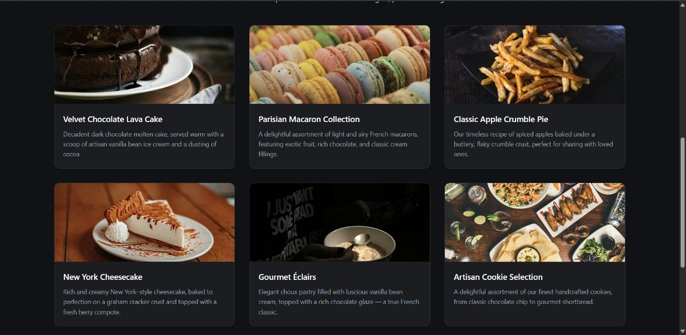
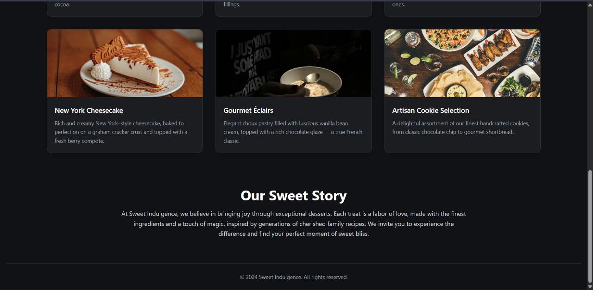
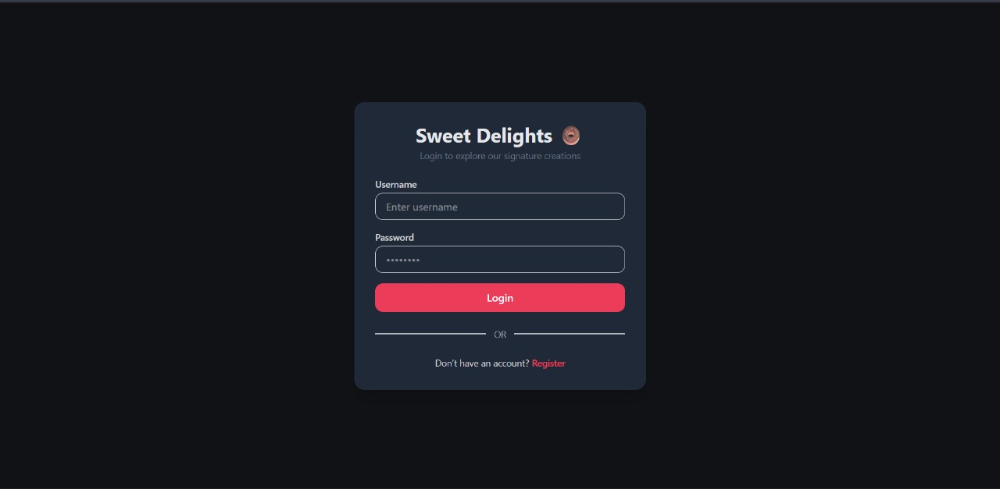
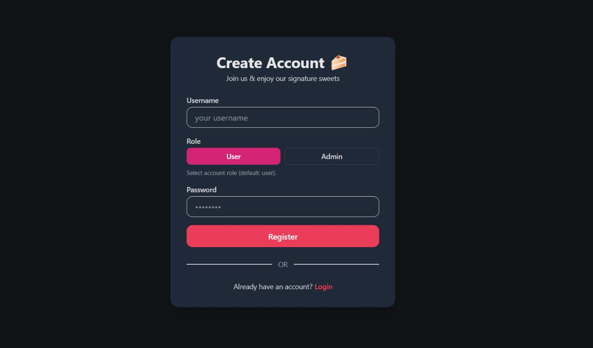
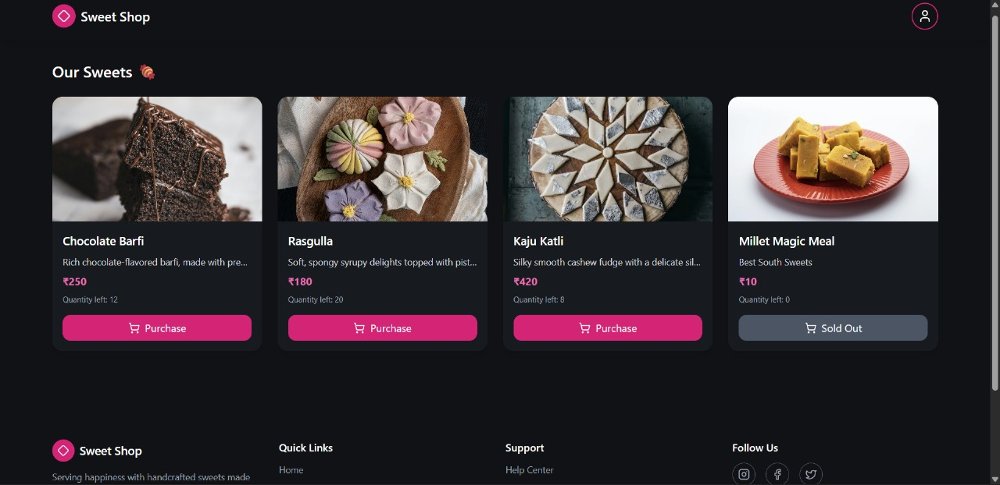
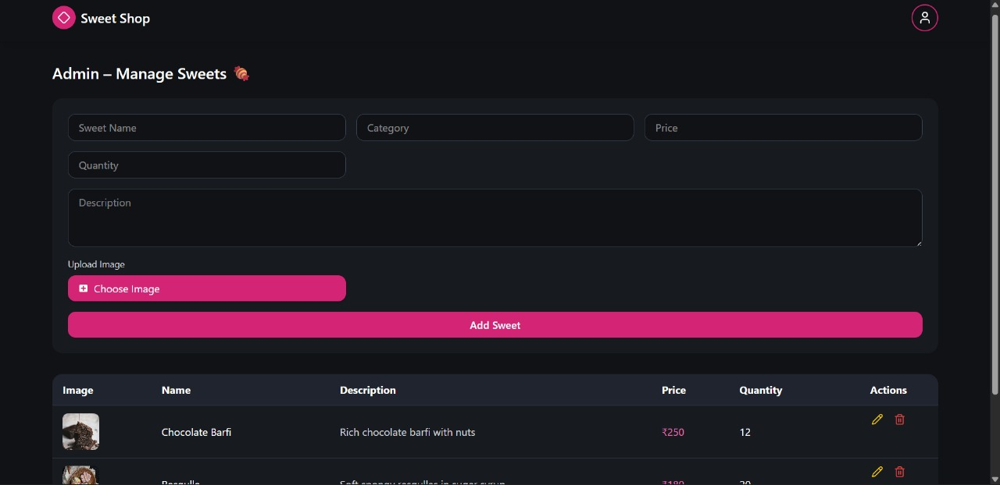

# TDD Kata: Sweet Shop Management System

## 📌 Project Overview
The **Sweet Shop Management System** is a full-stack web application developed using **Test-Driven Development (TDD)** principles. The system allows users to browse sweets, while administrators can manage sweets and users efficiently. The application is divided into a **Spring Boot backend** and a **React frontend**, communicating via RESTful APIs.

This project demonstrates clean architecture, REST API design, role-based access with jwt , and frontend-backend integration.

---

## 🛠️ Tech Stack

### Backend
- Java 17+
- Spring Boot
- Spring Web
- Spring Data JPA
- Hibernate
- MySQL / H2 (configurable)
- JUnit & Mockito

### Frontend
- React (Vite)
- JavaScript (ES6+)
- Axios
- React Router
- CSS

---

## 📂 Project Structure
```text
root/
├── Backend/        # Spring Boot application
├── frontend/       # React application
├── screenshots/    # Application screenshots
└── README.md

```

## ⚙️ Backend Setup (Spring Boot)

### Prerequisites
- Java 17 or later
- Maven
- MySQL (optional if using H2)

### Steps to Run Backend

```bash
cd Backend
mvn clean install
mvn spring-boot:run

```
### Backend will start at:
```bash
http://localhost:8080
```
### Backend Features

- RESTful APIs for sweets and users
- Role-based access (Admin / User)
- Proper entity mapping
- TDD-based unit and integration testing

### ⚙️ Frontend Setup (React)
Prerequisites

- Node.js (v18+ recommended)
- npm or yarn

### Steps to Run Frontend
```bash
cd frontend
npm install
npm run dev

```
### Frontend will start at:
```bash
http://localhost:5173
```
### Frontend Features

- User authentication (Login & Register)
- Role-based dashboards (Admin & User)
- Sweet listing and management
- Axios-based API integration

### 🔗 API Integration

- REST API communication between frontend and backend
- Axios for HTTP requests
- CORS configuration handled in backend

### 🧪 Testing

- Backend follows Test-Driven Development (TDD)
- Tests written using JUnit and Mockito
- Run tests using:
```bash
mvn test
```
## 🖼️ Screenshots

All application screenshots are available in the `screenshots/` folder.

### Application Screens

#### Home Page




#### Authentication



#### Dashboards



## 🤖 My AI Usage
AI Tools Used

- ChatGPT
- GitHub Copilot

How I Used AI Tools

- Used ChatGPT to:
- Understand TDD principles
- Design REST API endpoints
- Debug Spring Boot and React issues
- Improve README documentation

Used GitHub Copilot to:

- Generate boilerplate backend code
- Assist with unit tests
- Speed up React component development

### Reflection on AI Impact

AI tools improved productivity, code quality, and understanding of backend concepts. All AI-generated code was reviewed, tested, and modified to ensure correctness and learning.

### 🚀 Future Enhancements

- Cloud deployment (AWS / Vercel)
- Improved UI/UX
- Pagination

### 📎 Deliverables Checklist

- ✅ Public GitHub repository

- ✅ Complete README.md

- ✅ Screenshots folder

- ✅ Backend & frontend setup instructions

- ✅ My AI Usage section

### 👤 Author

Anup


